### Hi, I'm Bernd 👋

<!--  -->
I'm a core maintainer of Dapr (Distributed Application Runtime), https://dapr.io.

I spend a lot of time thinking about open source approaches to cloud and developer infrastructure and tooling.

## Find me here on the internet
- Twitter: [@berndverst](https://twitter.com/berndverst)
- Instagram: [@berndverst](https://instagram.com/berndverst)
- Facebook: [Bernd Verst](https://facebook.com/verst)

You can also find me in the Dapr Discord Server, the Kubernetes, Docker, Kubeflow community Slack instances.
<!--
**berndverst/berndverst** is a ✨ _special_ ✨ repository because its `README.md` (this file) appears on your GitHub profile.

Here are some ideas to get you started:

- 🔭 I’m currently working on ...
- 🌱 I’m currently learning ...
- 👯 I’m looking to collaborate on ...
- 🤔 I’m looking for help with ...
- 💬 Ask me about ...
- 📫 How to reach me: ...
- 😄 Pronouns: ...
- ⚡ Fun fact: ...
-->
